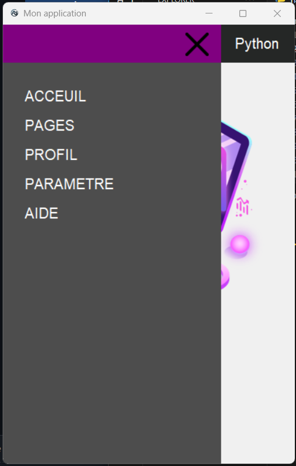

# Application

Un projet de création d'application tkinter avec une barre de navigation latérale.

## Description

Ce projet est une application tkinter qui démontre la création d'une interface utilisateur avec une barre de navigation latérale. L'application présente une mise en page simple avec une image de fond et des options de navigation latérales.

## Fonctionnalités

- Barre de navigation latérale animée
- Options de navigation
- Changement de thème

## Captures d'écran

<div style="display: flex; justify-content: center;">
    
    
</div>

## Installation

- Installez les dépendances :
    ```bash
    pip install tk
    pip install Pillow
    ```


